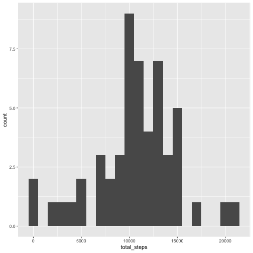
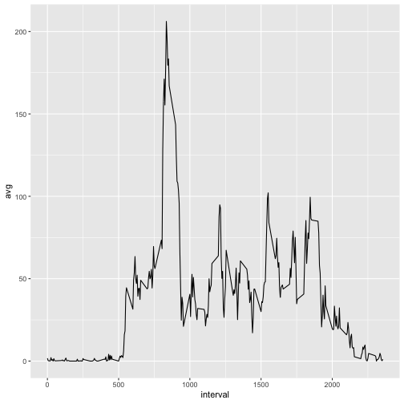
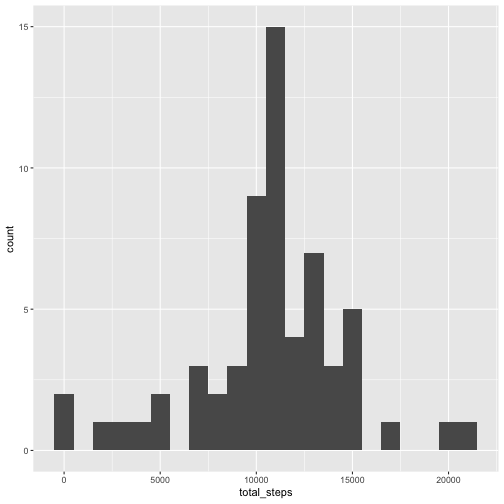
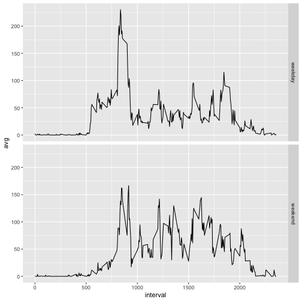

# Loading and preprocessing the data

```r
library(dplyr)
library(ggplot2)
data <- read.csv('data/activity.csv')
```

# What is mean total number of steps taken per day?
1. Total number of steps:

```r
sum(data$steps, na.rm = T)
```

```
## [1] 570608
```

2. Histogram of total number of steps taken each day

```r
grouped <- data %>%
  filter(!is.na(steps)) %>%
  group_by(date) %>%
  summarize(total_steps = sum(steps))

ggplot(grouped, aes(x=total_steps)) +
  geom_histogram(binwidth = 1000)
```



3. Mean and Median of total steps per day

```r
paste('mean: ', mean(grouped$total_steps))
```

```
## [1] "mean:  10766.1886792453"
```

```r
paste('median: ', median(grouped$total_steps))
```

```
## [1] "median:  10765"
```

# What is the average daily activity pattern?
1. The following plot shows the average number of steps taken for a given 5-minute period over the course of all days in the dataset:

```r
interval_group <- data %>%
  group_by(interval) %>%
  summarize(n(), avg = mean(steps, na.rm = T))

ggplot(interval_group, aes(x=interval, y=avg)) +
  geom_line()
```



2. We can also pick out the 5-minute interval that contains the maximum average number of steps:

```r
max_interval <- interval_group %>%
  filter(avg == max(avg)) %>%
  select(interval)
print(max_interval$interval)
```

```
## [1] 835
```

# Imputing missing values
1. Here are the total number of missing values in the dataset.

```r
sum(is.na(data))
```

```
## [1] 2304
```

2. In order to fill in all of the missing values, we're going to use the average daily value for each steps value that has an NA value. 

3. The following code accomplishes the imputation:

```r
imputed_data <- data.frame(data)
for(row in 1:nrow(imputed_data)) {
  step_value = imputed_data[row, 1]
  interval_value = imputed_data[row, 3]
  if(is.na(step_value)) {
    imputed_data[row, 1] = interval_group$avg[which(interval_group$interval == interval_value)]
  }
}
```

4. Here is an updated histogram of the new imputed dataset along with the mean and median:

```r
imputed_grouped <- imputed_data %>%
  group_by(date) %>%
  summarize(total_steps = sum(steps))

ggplot(imputed_grouped, aes(x=total_steps)) +
  geom_histogram(binwidth = 1000)
```



```r
paste('mean: ', mean(imputed_grouped$total_steps))
```

```
## [1] "mean:  10766.1886792453"
```

```r
paste('median: ', median(imputed_grouped$total_steps))
```

```
## [1] "median:  10766.1886792453"
```

We see that mean and median are very close to the original values calculated previously. However, looking at the histogram we can see that the total daily number of steps did, in fact, increase pretty drastically in certain circumstances. So we can conclude that when looking at average values we will probably get similar results between ignoring NA values and imputing them from the mean. The aggregate resuts, however, will be higher in the situation where we impute the NA values.

# Are there differences in activity patterns between weekdays and weekends?
1. To investigate this, first we'll make a new factor variable indicating whether the day is a weekday or weekend:

```r
imputed_data$date = as.POSIXct(imputed_data$date)
imputed_data <- imputed_data %>%
  mutate(isWeekday = if_else(weekdays(date) == 'Saturday' | weekdays(date) == 'Sunday', 'weekend', 'weekday'))
```

2. Plot of the results:

```r
day_grouping <- imputed_data %>%
  group_by(interval, isWeekday) %>%
  summarize(avg = mean(steps))

ggplot(day_grouping, aes(x=interval, y=avg)) +
  geom_line() +
  facet_grid(isWeekday~.)
```


